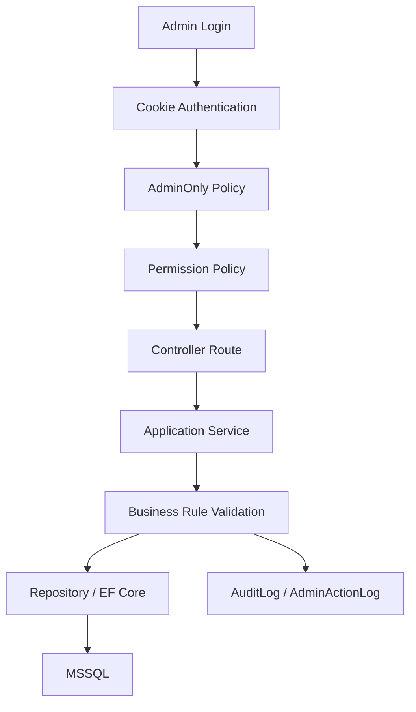

# 00｜後台可控管管理模式總覽

## 結論

後台應採用「模組化管理 + 權限控管 + 操作稽核 + 狀態流程」的模式，而不是把所有功能做成單純 CRUD。管理者看到的是營運工作台，系統實作則必須確保每個功能都有權限、資料來源、狀態規則與稽核紀錄。

---

## 1. 後台定位

後台不是前台頁面的延伸，而是電商營運控制中心。

後台負責：

```text
□ 管理商品是否能被前台看見
□ 管理 SKU、價格、圖片與商品狀態
□ 管理庫存、保留庫存與庫存異動
□ 管理訂單、付款、出貨與退款
□ 管理優惠券、促銷與行銷活動
□ 管理會員、員工、角色與權限
□ 管理稽核紀錄、系統設定與營運警示
□ 顯示營運指標與待處理事項
```

後台不應負責：

```text
□ 直接信任前台傳來的價格
□ 由 Controller 直接寫入 DbContext
□ 讓 Entity 直接回傳前端
□ 只用畫面隱藏按鈕當作權限控管
□ 在正式資料中保留 Template 假資料
□ 未經稽核就允許高風險操作
```

---

## 2. 建議後台選單分層

目前專案 `_AdminLayout.cshtml` 已經採用下列選單邏輯，建議保留：

```text
營運總覽
├─ Dashboard

商品與交易
├─ 商品管理
├─ SKU 管理
├─ 庫存管理
├─ 訂單管理
├─ 付款管理
├─ 出貨管理
└─ 退款管理

行銷與洞察
├─ 數據分析
├─ 優惠券
├─ 促銷活動
└─ 訊息通知

權限與系統
├─ 使用者管理
├─ 角色權限
├─ 稽核紀錄
└─ 系統設定
```

這樣排序的原因是：

| 區塊 | 管理目的 | 使用者情境 |
|---|---|---|
| 營運總覽 | 讓管理者先看到今日異常與待辦 | 每天登入第一頁 |
| 商品與交易 | 控制電商核心資料流 | 商品人員、訂單人員、倉儲人員 |
| 行銷與洞察 | 控制營收推動與分析資料 | 行銷人員、營運主管 |
| 權限與系統 | 控制人員、權限、稽核與設定 | 系統管理員、稽核角色 |

---

## 3. 後台控制鏈

後台權限不能只做在選單或畫面上，必須形成完整控制鏈：



每一層責任：

| 層級 | 責任 | 不可替代原因 |
|---|---|---|
| Cookie Authentication | 確認登入狀態 | 未登入不能進後台 |
| AdminOnly Policy | 確認 UserType 是 Admin / Staff | Customer 不能進入後台 |
| Permission Policy | 確認功能權限 | 不同角色看到不同頁面 |
| Controller | 只負責路由、授權入口、DTO 回傳 | 不放商業邏輯 |
| Service | 驗證權限、交易規則、狀態轉換 | 核心控制點 |
| Repository | 封裝資料查詢與寫入 | 避免 Controller 直接操作 DbContext |
| AuditLog / AdminActionLog | 記錄高風險異動 | 出事可以追溯 |

---

## 4. 四大模組邊界

| 模組 | 頁面 | 核心資料 | 高風險操作 |
|---|---|---|---|
| 營運總覽 | `Index.cshtml` | Orders, Payments, InventoryStocks, Refunds, AuditLogs | 無直接異動，僅導向處理頁 |
| 商品與交易 | Products, ProductSkus, Inventory, Orders, Payments, Shipments, Refunds | Products, ProductSkus, InventoryStocks, Orders, Payments, Shipments, Refunds | 改價、上架、調庫存、出貨、退款 |
| 行銷與洞察 | Analytics, Coupons, Promotions, Inbox | Coupons, Promotions, OrderDiscounts, CouponUsages, Orders, Payments | 發布促銷、停用優惠、查看營收 |
| 權限與系統 | Users, Roles, AuditLogs, Settings | Users, Roles, Permissions, RolePermissions, UserLoginLogs, AuditLogs | 指派權限、停用帳號、修改安全設定 |

---

## 5. 後台頁面與現有檔案對應

| 管理區 | Razor View | Controller Action | 權限 |
|---|---|---|---|
| 營運總覽 | `Views/Admin/Index.cshtml` | `AdminController.Index` | `Dashboard.Read` |
| 數據分析 | `Views/Admin/Analytics.cshtml` | `AdminController.Analytics` | `Analytics.Read` |
| 使用者管理 | `Views/Admin/Users.cshtml` | `AdminController.Users` | `Users.Manage` |
| 角色權限 | `Views/Admin/Roles.cshtml` | `AdminController.Roles` | `Roles.Manage` |
| 商品管理 | `Views/Admin/Products.cshtml` | `AdminController.Products` | `Products.Read` |
| 商品新增修改 | `Views/Admin/ProductEdit.cshtml` | `AdminController.ProductEdit` | `Products.Write` |
| SKU 管理 | `Views/Admin/ProductSkus.cshtml` | `AdminController.ProductSkus` | `Products.Write` |
| 庫存管理 | `Views/Admin/Inventory.cshtml` | `AdminController.Inventory` | `Inventory.Read` |
| 訂單管理 | `Views/Admin/Orders.cshtml` | `AdminController.Orders` | `Orders.Read` |
| 訂單詳細 | `Views/Admin/OrderDetails.cshtml` | `AdminController.OrderDetails` | `Orders.Read` |
| 付款管理 | `Views/Admin/Payments.cshtml` | `AdminController.Payments` | `Payments.Read` |
| 出貨管理 | `Views/Admin/Shipments.cshtml` | `AdminController.Shipments` | `Shipments.Manage` |
| 退款管理 | `Views/Admin/Refunds.cshtml` | `AdminController.Refunds` | `Refunds.Manage` |
| 優惠券 | `Views/Admin/Coupons.cshtml` | `AdminController.Coupons` | `Coupons.Manage` |
| 促銷活動 | `Views/Admin/Promotions.cshtml` | `AdminController.Promotions` | `Promotions.Manage` |
| 訊息通知 | `Views/Admin/Inbox.cshtml` | `AdminController.Inbox` | `Messages.Read` |
| 稽核紀錄 | `Views/Admin/AuditLogs.cshtml` | `AdminController.AuditLogs` | `AuditLogs.Read` |
| 系統設定 | `Views/Admin/Settings.cshtml` | `AdminController.Settings` | `Settings.Manage` |

---

## 6. 後台狀態設計原則

後台資料不應只用「新增、修改、刪除」思維，而要用狀態控制。

| 資料 | 建議狀態 | 控制重點 |
|---|---|---|
| 商品 | Draft, Review, Published, Unpublished, Archived | 未上架不得出現在前台可購清單 |
| SKU | Active, Inactive, Discontinued | SKU 停用不等於刪除歷史訂單資料 |
| 庫存保留 | Reserved, Released, Consumed | 下單保留，出貨扣實際庫存 |
| 訂單 | PendingPayment, Paid, Processing, Shipped, Completed, Cancelled | 已付款不等於自動出貨 |
| 付款 | Pending, Paid, Failed, Expired, Refunded | Callback 必須驗簽與冪等 |
| 出貨 | Pending, Picking, Shipped, Delivered, Failed | 出貨後才消耗保留庫存 |
| 退款 | Requested, Approved, Rejected, Refunded, Failed | 支援部分退款與品項退款 |
| 優惠券 | Draft, Active, Paused, Expired | 發布後需控管使用上限與時間 |
| 促銷 | Draft, Scheduled, Active, Paused, Ended | 折扣來源需記錄於 OrderDiscounts |

---

## 7. 本階段建議先完成的成果

```text
□ 保留現有 Admin Razor 頁面與選單分類
□ 補齊 Admin API 命名與權限對應
□ 補齊 Service / Repository 介面
□ 所有高風險操作寫入 AdminActionLog 或 AuditLog
□ Dashboard 從真實資料來源查詢，不使用假資料作正式數據
□ 將權限矩陣寫成種子資料與測試案例
```
