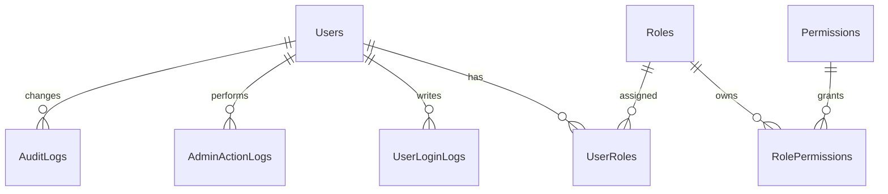

# 01｜權限與系統設計

## 結論

後台權限應採用 RBAC，也就是「User → Role → Permission」模型。頁面選單只負責顯示，真正安全必須由 `Authorize Policy`、Service 權限檢查、資料範圍限制與稽核紀錄共同完成。

---

## 1. 權限與系統模組範圍

權限與系統模組包含：

```text
□ 使用者管理
□ 角色管理
□ 權限指派
□ 後台登入紀錄
□ 後台操作紀錄
□ 資料異動稽核
□ 系統錯誤紀錄
□ 系統設定
□ 安全設定
```

對應目前頁面：

| 頁面 | View | 權限 |
|---|---|---|
| 使用者管理 | `Views/Admin/Users.cshtml` | `Users.Manage` |
| 角色權限 | `Views/Admin/Roles.cshtml` | `Roles.Manage` |
| 稽核紀錄 | `Views/Admin/AuditLogs.cshtml` | `AuditLogs.Read` |
| 系統設定 | `Views/Admin/Settings.cshtml` | `Settings.Manage` |

---

## 2. 資料模型

目前專案已有下列 Entity，可作為權限核心：

```text
Users
Roles
Permissions
UserRoles
RolePermissions
UserLoginLogs
AuditLogs
AdminActionLogs
SystemErrorLogs
```

建議關聯：



---

## 3. UserType 與角色分工

`UserType` 用來判斷使用者大類，`Role` 用來判斷後台可做什麼。

| UserType | 是否可進後台 | 說明 |
|---|---:|---|
| Customer | 否 | 前台會員，只能操作自己的購物與訂單資料 |
| Staff | 是 | 後台員工，需依角色取得權限 |
| Admin | 是 | 後台管理者，可管理高權限模組 |

建議角色：

| 角色代碼 | 角色名稱 | 適用對象 | 權限重點 |
|---|---|---|---|
| `SystemAdmin` | 系統管理員 | 專案負責人 / 技術管理者 | 全權限、系統設定、角色權限 |
| `OperationsManager` | 營運主管 | 電商營運負責人 | Dashboard、Analytics、Orders、Products、Promotions |
| `ProductManager` | 商品管理員 | 商品維護人員 | Products、SKU、Inventory.Read |
| `OrderStaff` | 訂單客服人員 | 訂單處理人員 | Orders、Shipments、Messages |
| `FinanceStaff` | 財務人員 | 對帳與退款人員 | Payments、Refunds、Analytics.Read |
| `MarketingStaff` | 行銷人員 | 活動與優惠維護 | Coupons、Promotions、Analytics.Read |
| `Auditor` | 稽核人員 | 稽核 / 管理者 | AuditLogs.Read、唯讀查詢 |

---

## 4. 權限矩陣

| 權限 | SystemAdmin | OperationsManager | ProductManager | OrderStaff | FinanceStaff | MarketingStaff | Auditor |
|---|---:|---:|---:|---:|---:|---:|---:|
| `Dashboard.Read` | ✓ | ✓ | ✓ | ✓ | ✓ | ✓ | ✓ |
| `Analytics.Read` | ✓ | ✓ |  |  | ✓ | ✓ | ✓ |
| `Users.Manage` | ✓ |  |  |  |  |  |  |
| `Roles.Manage` | ✓ |  |  |  |  |  |  |
| `Products.Read` | ✓ | ✓ | ✓ |  |  | ✓ | ✓ |
| `Products.Write` | ✓ | ✓ | ✓ |  |  |  |  |
| `Inventory.Read` | ✓ | ✓ | ✓ | ✓ |  |  | ✓ |
| `Inventory.Adjust` | ✓ | ✓ | ✓ |  |  |  |  |
| `Orders.Read` | ✓ | ✓ |  | ✓ | ✓ |  | ✓ |
| `Orders.Write` | ✓ | ✓ |  | ✓ |  |  |  |
| `Payments.Read` | ✓ | ✓ |  |  | ✓ |  | ✓ |
| `Shipments.Manage` | ✓ | ✓ |  | ✓ |  |  |  |
| `Refunds.Manage` | ✓ | ✓ |  |  | ✓ |  |  |
| `Coupons.Manage` | ✓ | ✓ |  |  |  | ✓ |  |
| `Promotions.Manage` | ✓ | ✓ |  |  |  | ✓ |  |
| `Messages.Read` | ✓ | ✓ |  | ✓ |  | ✓ |  |
| `AuditLogs.Read` | ✓ |  |  |  |  |  | ✓ |
| `Settings.Manage` | ✓ |  |  |  |  |  |  |

---

## 5. 權限控管層級

### 5.1 Controller 層

目前專案已有：

```csharp
[Authorize(Policy = "AdminOnly")]
[Route("admin")]
public sealed class AdminController : Controller
{
    [HttpGet("products")]
    [Authorize(Policy = "Products.Read")]
    public Task<IActionResult> Products(CancellationToken cancellationToken)
    {
        return Module("products", cancellationToken);
    }
}
```

此做法正確，建議維持。

### 5.2 Layout 層

`_AdminLayout.cshtml` 的 `CanSee(permission)` 用於控制選單顯示。

注意：

```text
選單隱藏只是 UX，不是安全本體。
```

### 5.3 Service 層

高風險操作必須在 Service 再檢查一次，例如：

```text
□ 調整庫存：Inventory.Adjust
□ 建立退款：Refunds.Manage
□ 發布促銷：Promotions.Manage
□ 指派角色：Roles.Manage
□ 停用帳號：Users.Manage
□ 修改系統設定：Settings.Manage
```

---

## 6. 高風險操作控管

| 操作 | 風險 | 控管方式 |
|---|---|---|
| 指派 Admin 角色 | 權限外洩 | 僅 SystemAdmin，可記錄操作前後差異 |
| 停用後台帳號 | 影響營運 | 不允許停用最後一個 SystemAdmin |
| 調整庫存 | 影響可售量與出貨 | 寫入 InventoryTransactions + AuditLog |
| 改 SKU 售價 | 影響營收 | 寫入 AuditLog，必要時需二次確認 |
| 建立退款 | 影響金流 | 支援部分退款，需記錄 RefundItems |
| 發布促銷 | 影響大量訂單折扣 | 發布前檢查時間、商品範圍、上限 |
| 修改系統設定 | 影響全站安全 | 必須記錄 AdminActionLog |

---

## 7. 系統設定建議

`Settings.Manage` 不應一開始就做成萬能設定頁，而應先限定範圍。

建議分區：

```text
安全設定
├─ 後台 Cookie 有效時間
├─ 登入失敗鎖定規則
├─ CSRF Header 名稱顯示
└─ 可信任網域提示

營運設定
├─ 預設運費
├─ 低庫存警示門檻
├─ 訂單自動取消時間
└─ 退款審核門檻

通知設定
├─ 低庫存通知
├─ 付款失敗通知
├─ 退款申請通知
└─ 系統錯誤通知
```

---

## 8. 登入與安全要求

目前專案已經有 Cookie Authentication、CSRF Token、AdminOnly Policy，後續應補：

```text
□ 登入失敗 Rate Limiting
□ 後台登入 IP / UserAgent 紀錄
□ 登入失敗不透露帳號是否存在
□ 記住我僅延長 Cookie，不暴露密碼
□ 正式環境 Cookie 必須 Secure + HttpOnly
□ API 狀態變更方法必須檢查 CSRF
□ 後台頁面加上 noindex,nofollow
```

---

## 9. 稽核紀錄規則

| 操作類型 | 寫入表 | 記錄內容 |
|---|---|---|
| 登入成功 / 失敗 | `UserLoginLogs` | 帳號、結果、失敗原因、IP、UserAgent |
| 高風險功能操作 | `AdminActionLogs` | 模組、動作、目標資料、操作者、IP |
| 重要資料異動 | `AuditLogs` | TableName、RecordId、OldValueJson、NewValueJson |
| 系統例外 | `SystemErrorLogs` | ErrorLevel、Source、Message、StackTrace、RequestPath |

---

## 10. 驗收條件

```text
□ Customer 不能進入 /admin
□ Staff 沒有權限時看不到選單，直接輸入 URL 也會 403
□ 高風險操作不只檢查畫面按鈕，也在 Service 檢查
□ 新增、修改、刪除、發布、退款、調庫存都有稽核紀錄
□ 角色權限可以由種子資料建立，也能由後台維護
□ 不允許刪除最後一個 SystemAdmin
□ AuditLog 頁面只能由 AuditLogs.Read 查看
```
