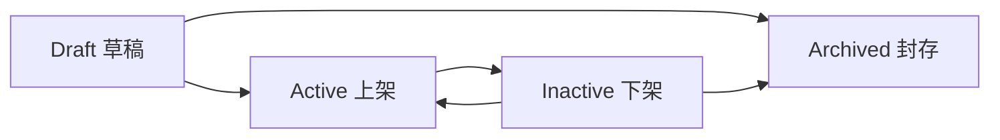
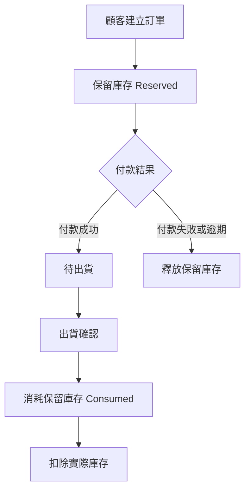
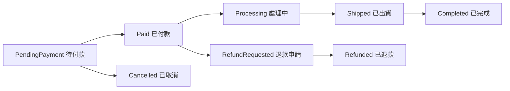
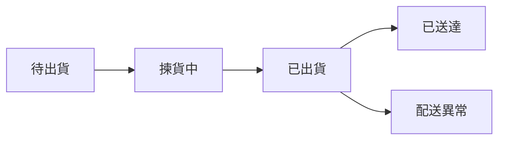
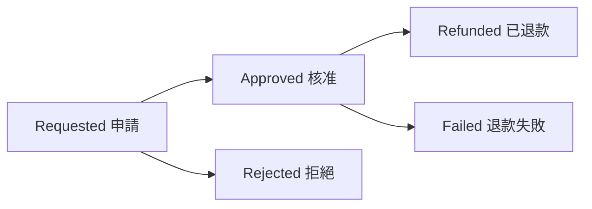

# 02｜商品與交易設計

## 結論

商品與交易是後台核心，應從「商品能不能賣、庫存夠不夠、訂單能不能履約、付款是否成功、出貨是否完成、退款是否正確」六個面向控管。此模組不應只做 CRUD，而要以狀態流程、庫存保留、付款冪等與退款稽核為核心。

---

## 1. 模組範圍

商品與交易包含：

```text
□ 商品管理
□ SKU 管理
□ 商品圖片管理
□ 庫存查詢
□ 庫存調整
□ 訂單查詢
□ 訂單狀態管理
□ 付款紀錄查詢
□ 出貨管理
□ 退款管理
```

對應頁面：

| 頁面 | View | 權限 |
|---|---|---|
| 商品管理 | `Products.cshtml` | `Products.Read` |
| 商品新增修改 | `ProductEdit.cshtml` | `Products.Write` |
| SKU 管理 | `ProductSkus.cshtml` | `Products.Write` |
| 庫存管理 | `Inventory.cshtml` | `Inventory.Read` / `Inventory.Adjust` |
| 訂單管理 | `Orders.cshtml` | `Orders.Read` / `Orders.Write` |
| 訂單詳細 | `OrderDetails.cshtml` | `Orders.Read` |
| 付款管理 | `Payments.cshtml` | `Payments.Read` |
| 出貨管理 | `Shipments.cshtml` | `Shipments.Manage` |
| 退款管理 | `Refunds.cshtml` | `Refunds.Manage` |

---

## 2. 商品生命週期

商品管理不應只分成有資料與沒資料，而要有生命週期。



狀態規則：

| 狀態 | 前台是否可見 | 是否可購買 | 後台操作 |
|---|---:|---:|---|
| Draft | 否 | 否 | 可編輯、可補 SKU、可補圖 |
| Active | 是 | 視 Active SKU 與庫存而定 | 可下架、可管理價格與圖片 |
| Inactive | 否 | 否 | 可重新上架，保留既有歷史資料 |
| Archived | 否 | 否 | 不可再販售，只保留歷史紀錄 |

商品上架前檢查：

```text
□ 商品名稱不可空白
□ 分類必須有效
□ 至少一個 Active SKU
□ SKU 必須有售價
□ 至少一張主圖
□ 商品 Status 合法
□ 前台不可看到 Draft / Inactive / Archived 商品
```

---

## 3. SKU 與價格控管

SKU 是實際販售單位，商品只是展示主檔。

| 欄位 | 控管重點 |
|---|---|
| `SkuNo` | 不可重複，對外可作為營運識別 |
| `Barcode` | 可選，用於倉儲或掃碼 |
| `SkuName` | 規格名稱，例如 2 公斤禮盒 |
| `ListPrice` | 原價，不一定是成交價 |
| `SalePrice` | 售價，訂單建立時需快照 |
| `CostPrice` | 成本價，僅高權限可查看 |
| `Status` | Active / Inactive |

重要規則：

```text
□ 前台送出的價格不可被信任
□ 訂單價格必須由後端依 SKU 與促銷規則重新計算
□ 已成立訂單需保存 ProductNameSnapshot、SkuNameSnapshot、UnitPrice
□ 改價必須寫 AuditLog
□ CostPrice 不應回傳給一般後台角色
```

---

## 4. 庫存控管

目前資料模型已支援：

```text
Warehouses
InventoryStocks
InventoryTransactions
InventoryReservations
```

建議庫存公式：

```text
AvailableQty = OnHandQty - ReservedQty
```

庫存流程：



庫存異動類型建議：

| TransactionType | 說明 | 是否需備註 |
|---|---|---:|
| PurchaseIn | 採購入庫 | ✓ |
| SaleOut | 出貨扣庫 | ✓ |
| Adjustment | 人工調整 | ✓ |
| Reservation | 保留庫存 | ✓ |
| Release | 釋放保留 | ✓ |
| ReturnIn | 退貨入庫 | ✓ |

---

## 5. 訂單流程



訂單欄位顯示：

```text
□ 訂單編號
□ 會員
□ 訂單金額
□ 折扣金額
□ 付款狀態
□ 出貨狀態
□ 訂單狀態
□ 建立時間
□ 操作者
```

訂單詳細頁必備區塊：

```text
□ 訂單主檔
□ 收件資訊
□ 訂單品項
□ 折扣明細
□ 付款紀錄
□ 出貨紀錄
□ 退款紀錄
□ 庫存保留紀錄
□ 訂單狀態歷史
□ 後台操作紀錄
```

---

## 6. 付款管理

付款管理是查詢與對帳為主，不建議讓一般人員直接改付款狀態。

資料來源：

```text
Payments
PaymentTransactions
Orders
```

付款規則：

```text
□ 付款 Callback 必須驗簽
□ Callback 必須冪等，同一筆交易不可重複入帳
□ PaymentStatus = Paid 只代表付款成功，不等於已出貨
□ 付款失敗不得扣實際庫存
□ 付款成功需更新 Order.PaymentStatus 與 Order.PaidAt
□ 金流 RequestPayload / ResponsePayload 若含敏感資料需遮罩
```

付款狀態：

| 狀態 | 說明 |
|---|---|
| Pending | 等待付款 |
| Paid | 已付款 |
| Failed | 付款失敗 |
| Expired | 逾期未付款 |
| Refunded | 已退款 |

---

## 7. 出貨管理

出貨管理重點是「付款成功後的履約」，不能在付款成功時自動扣除實際庫存。

出貨流程：



出貨規則：

```text
□ 只有 Paid 訂單可以建立出貨
□ 出貨數量不可超過訂單未出貨數量
□ 支援部分出貨時，ShipmentItems 必須記錄品項數量
□ 出貨確認後才消耗 InventoryReservations
□ 出貨完成需寫 OrderStatusHistory
□ 出貨異常需進入營運總覽待辦
```

---

## 8. 退款管理

退款必須支援整筆退款與部分退款。

資料來源：

```text
Refunds
RefundItems
Payments
Orders
OrderItems
```

退款流程：



退款規則：

```text
□ 不可退款超過原付款金額
□ 不可重複退款同一品項同一數量
□ 部分退款需記錄 RefundItems
□ 退款完成後需更新 Payment / Order 狀態
□ 是否回補庫存需依退貨檢查結果決定
□ 建立退款與核准退款都需寫入稽核紀錄
```

---

## 9. 商品與交易的 Service 切分

建議新增或補齊：

```text
Application/Interfaces/Admin/Catalog/IAdminProductService.cs
Application/Interfaces/Admin/Catalog/IAdminSkuService.cs
Application/Interfaces/Admin/Inventory/IAdminInventoryService.cs
Application/Interfaces/Admin/Orders/IAdminOrderService.cs
Application/Interfaces/Admin/Payments/IAdminPaymentService.cs
Application/Interfaces/Admin/Payments/IAdminShipmentService.cs
Application/Interfaces/Admin/Payments/IAdminRefundService.cs
```

Service 責任：

```text
□ 檢查 Permission
□ 驗證狀態是否可轉換
□ 重新計算價格與折扣
□ 建立交易一致性流程
□ 寫入 AuditLog / AdminActionLog
□ 回傳 DTO，不回傳 Entity
```

---

## 10. 驗收條件

```text
□ 未登入不能進商品與交易後台
□ 沒有 Products.Write 不能新增或修改商品
□ 商品上架前會檢查 SKU、價格、圖片與狀態
□ 訂單成立會保留庫存，不直接扣實際庫存
□ 付款成功不等於自動出貨
□ 出貨後才消耗保留庫存
□ 退款支援部分退款，且不會超額退款
□ 調整庫存、改價、退款、出貨都會留下稽核紀錄
```
