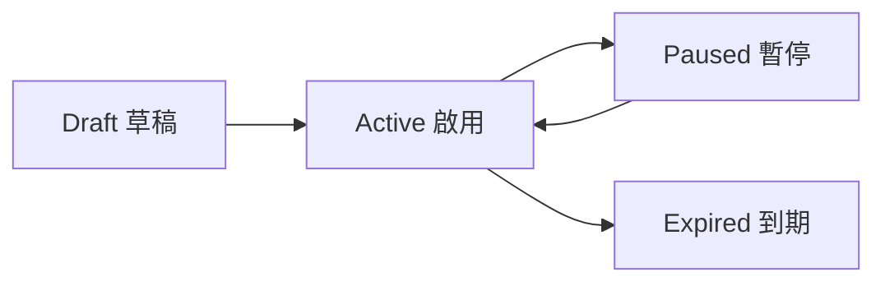
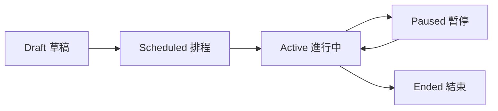

# 03｜行銷與洞察設計

## 結論

行銷與洞察模組負責「促進營收」與「理解營運表現」，但不能破壞交易一致性。優惠券與促銷必須可追溯折扣來源，數據分析必須只讀且受權限限制，訊息通知則應聚焦於營運異常與待處理事項。

---

## 1. 模組範圍

行銷與洞察包含：

```text
□ 數據分析
□ 優惠券管理
□ 促銷活動管理
□ 折扣來源追蹤
□ 會員與訂單洞察
□ 商品銷售排行
□ 訊息通知
□ 營運警示
```

對應頁面：

| 頁面 | View | 權限 |
|---|---|---|
| 數據分析 | `Analytics.cshtml` | `Analytics.Read` |
| 優惠券 | `Coupons.cshtml` | `Coupons.Manage` |
| 促銷活動 | `Promotions.cshtml` | `Promotions.Manage` |
| 訊息通知 | `Inbox.cshtml` | `Messages.Read` |

---

## 2. 數據分析設計

數據分析頁應以只讀查詢為主，不應在分析頁直接修改交易資料。

建議指標：

| 指標 | 資料來源 | 權限 | 說明 |
|---|---|---|---|
| 今日營收 | Orders, Payments | `Analytics.Read` | 只計算已付款或已完成訂單 |
| 訂單數 | Orders | `Analytics.Read` | 可依狀態分組 |
| 客單價 | Orders | `Analytics.Read` | 營收 / 訂單數 |
| 付款成功率 | Payments | `Analytics.Read` | Paid / 全部付款嘗試 |
| 退款率 | Refunds, Orders | `Analytics.Read` | 退款金額 / 營收 |
| 商品銷售排行 | OrderItems | `Analytics.Read` | 依數量或金額排序 |
| 分類銷售排行 | Products, ProductCategories, OrderItems | `Analytics.Read` | 分析類別表現 |
| 優惠券使用率 | Coupons, CouponUsages | `Analytics.Read` | UsedCount / TotalUsageLimit |
| 促銷轉換表現 | Promotions, OrderDiscounts | `Analytics.Read` | 促銷折扣與訂單成果 |

分析頁不可顯示：

```text
□ 沒有權限的人看到營收或成本
□ Template 假圖表被當作正式數據
□ 由前台傳來的金額直接計算報表
□ 未遮罩的個資或金流 Payload
```

---

## 3. 優惠券管理

目前資料模型包含：

```text
Coupons
CouponUsages
OrderDiscounts
```

優惠券欄位控管：

| 欄位 | 控管重點 |
|---|---|
| `CouponCode` | 不可重複，建議大寫英數字 |
| `DiscountType` | FixedAmount / Percentage |
| `DiscountValue` | 不可小於等於 0 |
| `MinOrderAmount` | 最低訂單門檻 |
| `MaxDiscountAmount` | 百分比折扣建議設定上限 |
| `TotalUsageLimit` | 全站可使用次數 |
| `PerUserUsageLimit` | 每位會員可使用次數 |
| `StartAt` / `EndAt` | 使用期間 |
| `Status` | Draft / Active / Paused / Expired |

優惠券流程：



優惠券規則：

```text
□ 優惠券只能由後端驗證
□ 前台輸入 CouponCode 後只取得試算結果
□ 下單時後端重新驗證優惠券有效性
□ 使用成功後寫入 CouponUsages
□ 訂單折扣來源寫入 OrderDiscounts
□ 優惠券不可超過使用上限
□ 優惠券發布後的關鍵欄位修改需寫 AuditLog
```

---

## 4. 促銷活動管理

目前資料模型包含：

```text
Promotions
PromotionProducts
OrderDiscounts
```

促銷類型建議：

| PromotionType | 說明 | 範例 |
|---|---|---|
| ProductDiscount | 指定商品折扣 | 芒果禮盒 9 折 |
| CategoryDiscount | 指定分類折扣 | 有機蔬菜滿額折 |
| ThresholdDiscount | 滿額折扣 | 滿 999 折 100 |
| BundleDiscount | 組合促銷 | A + B 組合價 |

促銷流程：



促銷規則：

```text
□ 促銷商品範圍必須明確記錄
□ 同一商品多個促銷同時適用時，需定義疊加規則
□ 折扣計算順序不得由前台決定
□ 每筆折扣都必須寫入 OrderDiscounts
□ 促銷開始與結束時間需使用伺服器時間判斷
□ 促銷發布、暫停、結束需寫 AdminActionLog
```

---

## 5. 折扣疊加原則

專案 ADR 已定義「優惠券與促銷可疊加並記錄折扣來源」，因此建議折扣順序如下：

```text
1. 商品原價 / 售價
2. 商品級促銷
3. 訂單級促銷
4. 優惠券
5. 運費優惠
6. 訂單總額確認
```

每一個折扣都要留下來源：

| 欄位 | 說明 |
|---|---|
| `DiscountSourceType` | Coupon / Promotion / Shipping / Manual |
| `CouponId` | 對應優惠券 |
| `PromotionId` | 對應促銷活動 |
| `DiscountName` | 當下折扣名稱快照 |
| `DiscountAmount` | 實際折扣金額 |

---

## 6. 訊息通知與營運警示

`Inbox.cshtml` 不應只是一般信箱，而應變成後台營運通知中心。

建議通知類型：

| 類型 | 觸發條件 | 導向頁面 |
|---|---|---|
| LowStock | 可售庫存低於安全庫存 | Inventory |
| PaymentFailed | 金流付款失敗或異常 | Payments |
| RefundRequested | 顧客提出退款 | Refunds |
| ShipmentDelayed | 訂單超過出貨時間 | Shipments |
| PromotionEnding | 促銷即將結束 | Promotions |
| LoginFailedSpike | 後台登入失敗過多 | AuditLogs / Settings |
| SystemError | 系統例外 | AuditLogs / System Logs |

---

## 7. 行銷與洞察 Service 切分

建議新增：

```text
Application/Interfaces/Admin/Analytics/IAdminAnalyticsService.cs
Application/Interfaces/Admin/Marketing/IAdminCouponService.cs
Application/Interfaces/Admin/Marketing/IAdminPromotionService.cs
Application/Interfaces/Admin/Notifications/IAdminNotificationService.cs
```

Service 責任：

```text
□ AnalyticsService 只能查詢，不做異動
□ CouponService 負責優惠券驗證、發布、停用
□ PromotionService 負責活動範圍、折扣規則、狀態轉換
□ NotificationService 負責建立、查詢、標記已讀與導向處理頁
```

---

## 8. 驗收條件

```text
□ 沒有 Analytics.Read 看不到營收與分析頁
□ 沒有 Coupons.Manage 不能新增、發布或停用優惠券
□ 沒有 Promotions.Manage 不能發布促銷活動
□ 優惠券使用會寫入 CouponUsages
□ 訂單折扣會寫入 OrderDiscounts
□ 促銷與優惠券時間由伺服器判斷
□ 分析頁所有資料來自後端查詢，不使用前台傳值
□ 通知中心能導向對應處理頁
```
