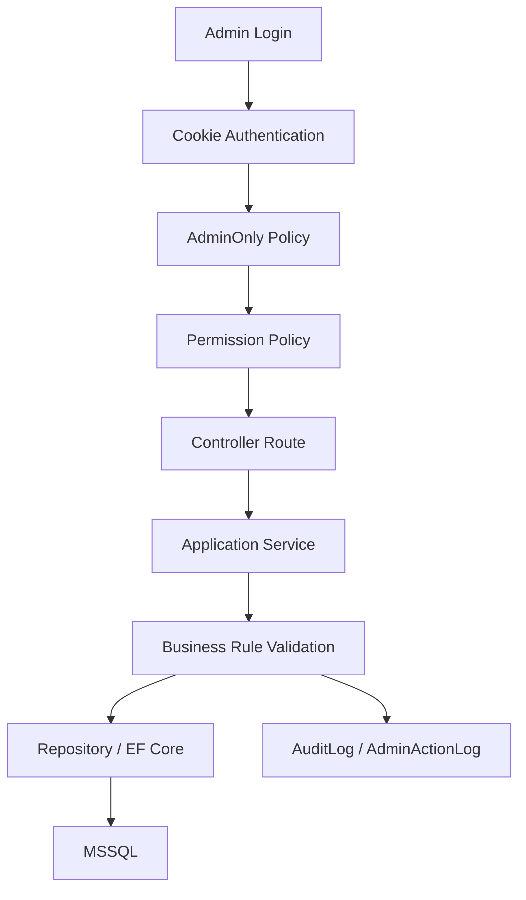
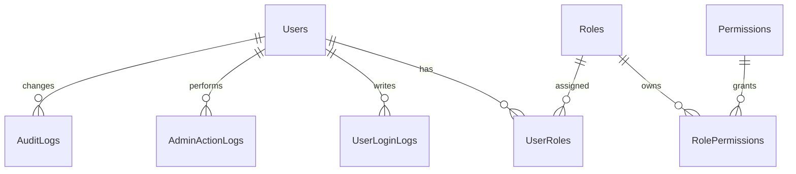
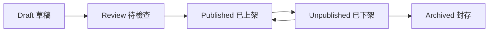
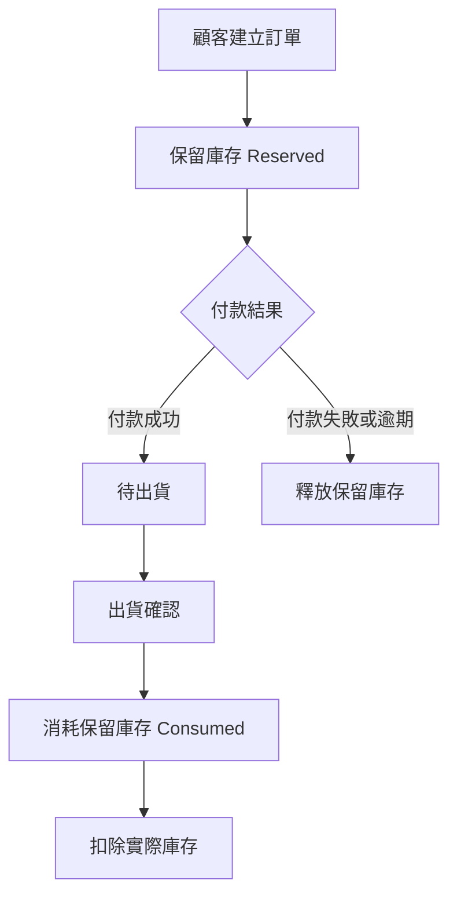
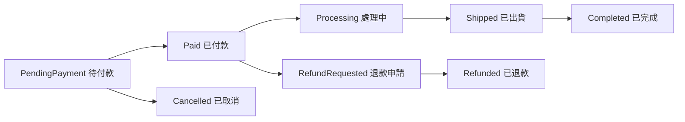
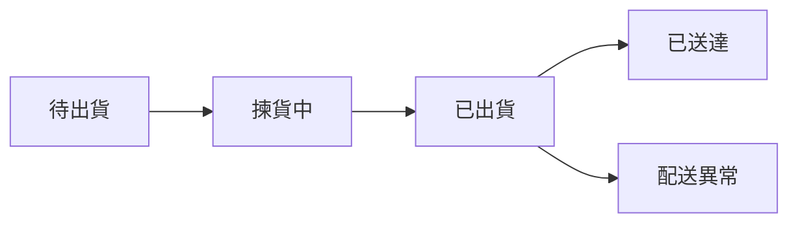
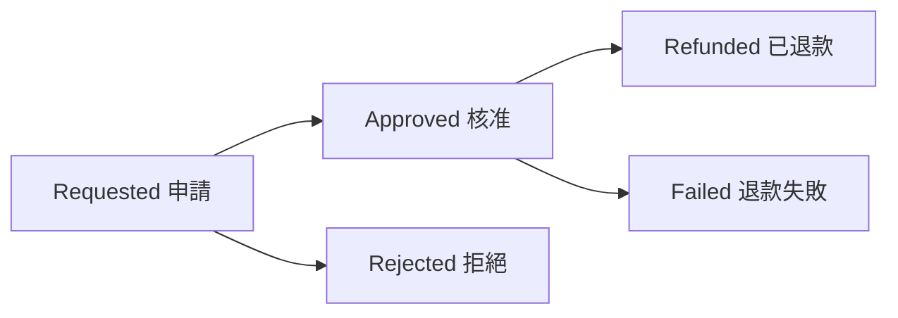
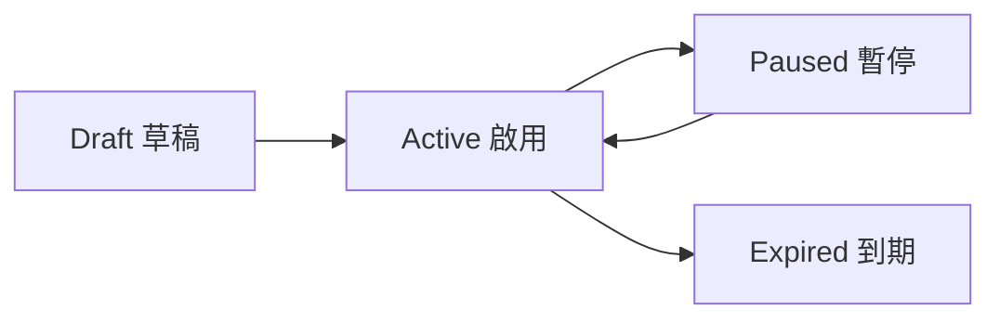
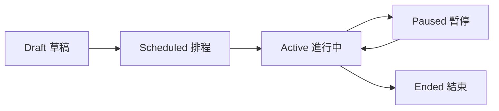

<!-- Source: 00_admin_control_model_overview.md -->

# 00｜後台可控管管理模式總覽

## 結論

後台應採用「模組化管理 + 權限控管 + 操作稽核 + 狀態流程」的模式，而不是把所有功能做成單純 CRUD。管理者看到的是營運工作台，系統實作則必須確保每個功能都有權限、資料來源、狀態規則與稽核紀錄。

---

## 1. 後台定位

後台不是前台頁面的延伸，而是電商營運控制中心。

後台負責：

```text
□ 管理商品是否能被前台看見
□ 管理 SKU、價格、圖片與商品狀態
□ 管理庫存、保留庫存與庫存異動
□ 管理訂單、付款、出貨與退款
□ 管理優惠券、促銷與行銷活動
□ 管理會員、員工、角色與權限
□ 管理稽核紀錄、系統設定與營運警示
□ 顯示營運指標與待處理事項
```

後台不應負責：

```text
□ 直接信任前台傳來的價格
□ 由 Controller 直接寫入 DbContext
□ 讓 Entity 直接回傳前端
□ 只用畫面隱藏按鈕當作權限控管
□ 在正式資料中保留 Template 假資料
□ 未經稽核就允許高風險操作
```

---

## 2. 建議後台選單分層

目前專案 `_AdminLayout.cshtml` 已經採用下列選單邏輯，建議保留：

```text
營運總覽
├─ Dashboard

商品與交易
├─ 商品管理
├─ SKU 管理
├─ 庫存管理
├─ 訂單管理
├─ 付款管理
├─ 出貨管理
└─ 退款管理

行銷與洞察
├─ 數據分析
├─ 優惠券
├─ 促銷活動
└─ 訊息通知

權限與系統
├─ 使用者管理
├─ 角色權限
├─ 稽核紀錄
└─ 系統設定
```

這樣排序的原因是：

| 區塊 | 管理目的 | 使用者情境 |
|---|---|---|
| 營運總覽 | 讓管理者先看到今日異常與待辦 | 每天登入第一頁 |
| 商品與交易 | 控制電商核心資料流 | 商品人員、訂單人員、倉儲人員 |
| 行銷與洞察 | 控制營收推動與分析資料 | 行銷人員、營運主管 |
| 權限與系統 | 控制人員、權限、稽核與設定 | 系統管理員、稽核角色 |

---

## 3. 後台控制鏈

後台權限不能只做在選單或畫面上，必須形成完整控制鏈：



每一層責任：

| 層級 | 責任 | 不可替代原因 |
|---|---|---|
| Cookie Authentication | 確認登入狀態 | 未登入不能進後台 |
| AdminOnly Policy | 確認 UserType 是 Admin / Staff | Customer 不能進入後台 |
| Permission Policy | 確認功能權限 | 不同角色看到不同頁面 |
| Controller | 只負責路由、授權入口、DTO 回傳 | 不放商業邏輯 |
| Service | 驗證權限、交易規則、狀態轉換 | 核心控制點 |
| Repository | 封裝資料查詢與寫入 | 避免 Controller 直接操作 DbContext |
| AuditLog / AdminActionLog | 記錄高風險異動 | 出事可以追溯 |

---

## 4. 四大模組邊界

| 模組 | 頁面 | 核心資料 | 高風險操作 |
|---|---|---|---|
| 營運總覽 | `Index.cshtml` | Orders, Payments, InventoryStocks, Refunds, AuditLogs | 無直接異動，僅導向處理頁 |
| 商品與交易 | Products, ProductSkus, Inventory, Orders, Payments, Shipments, Refunds | Products, ProductSkus, InventoryStocks, Orders, Payments, Shipments, Refunds | 改價、上架、調庫存、出貨、退款 |
| 行銷與洞察 | Analytics, Coupons, Promotions, Inbox | Coupons, Promotions, OrderDiscounts, CouponUsages, Orders, Payments | 發布促銷、停用優惠、查看營收 |
| 權限與系統 | Users, Roles, AuditLogs, Settings | Users, Roles, Permissions, RolePermissions, UserLoginLogs, AuditLogs | 指派權限、停用帳號、修改安全設定 |

---

## 5. 後台頁面與現有檔案對應

| 管理區 | Razor View | Controller Action | 權限 |
|---|---|---|---|
| 營運總覽 | `Views/Admin/Index.cshtml` | `AdminController.Index` | `Dashboard.Read` |
| 數據分析 | `Views/Admin/Analytics.cshtml` | `AdminController.Analytics` | `Analytics.Read` |
| 使用者管理 | `Views/Admin/Users.cshtml` | `AdminController.Users` | `Users.Manage` |
| 角色權限 | `Views/Admin/Roles.cshtml` | `AdminController.Roles` | `Roles.Manage` |
| 商品管理 | `Views/Admin/Products.cshtml` | `AdminController.Products` | `Products.Read` |
| 商品新增修改 | `Views/Admin/ProductEdit.cshtml` | `AdminController.ProductEdit` | `Products.Write` |
| SKU 管理 | `Views/Admin/ProductSkus.cshtml` | `AdminController.ProductSkus` | `Products.Write` |
| 庫存管理 | `Views/Admin/Inventory.cshtml` | `AdminController.Inventory` | `Inventory.Read` |
| 訂單管理 | `Views/Admin/Orders.cshtml` | `AdminController.Orders` | `Orders.Read` |
| 訂單詳細 | `Views/Admin/OrderDetails.cshtml` | `AdminController.OrderDetails` | `Orders.Read` |
| 付款管理 | `Views/Admin/Payments.cshtml` | `AdminController.Payments` | `Payments.Read` |
| 出貨管理 | `Views/Admin/Shipments.cshtml` | `AdminController.Shipments` | `Shipments.Manage` |
| 退款管理 | `Views/Admin/Refunds.cshtml` | `AdminController.Refunds` | `Refunds.Manage` |
| 優惠券 | `Views/Admin/Coupons.cshtml` | `AdminController.Coupons` | `Coupons.Manage` |
| 促銷活動 | `Views/Admin/Promotions.cshtml` | `AdminController.Promotions` | `Promotions.Manage` |
| 訊息通知 | `Views/Admin/Inbox.cshtml` | `AdminController.Inbox` | `Messages.Read` |
| 稽核紀錄 | `Views/Admin/AuditLogs.cshtml` | `AdminController.AuditLogs` | `AuditLogs.Read` |
| 系統設定 | `Views/Admin/Settings.cshtml` | `AdminController.Settings` | `Settings.Manage` |

---

## 6. 後台狀態設計原則

後台資料不應只用「新增、修改、刪除」思維，而要用狀態控制。

| 資料 | 建議狀態 | 控制重點 |
|---|---|---|
| 商品 | Draft, Review, Published, Unpublished, Archived | 未上架不得出現在前台可購清單 |
| SKU | Active, Inactive, Discontinued | SKU 停用不等於刪除歷史訂單資料 |
| 庫存保留 | Reserved, Released, Consumed | 下單保留，出貨扣實際庫存 |
| 訂單 | PendingPayment, Paid, Processing, Shipped, Completed, Cancelled | 已付款不等於自動出貨 |
| 付款 | Pending, Paid, Failed, Expired, Refunded | Callback 必須驗簽與冪等 |
| 出貨 | Pending, Picking, Shipped, Delivered, Failed | 出貨後才消耗保留庫存 |
| 退款 | Requested, Approved, Rejected, Refunded, Failed | 支援部分退款與品項退款 |
| 優惠券 | Draft, Active, Paused, Expired | 發布後需控管使用上限與時間 |
| 促銷 | Draft, Scheduled, Active, Paused, Ended | 折扣來源需記錄於 OrderDiscounts |

---

## 7. 本階段建議先完成的成果

```text
□ 保留現有 Admin Razor 頁面與選單分類
□ 補齊 Admin API 命名與權限對應
□ 補齊 Service / Repository 介面
□ 所有高風險操作寫入 AdminActionLog 或 AuditLog
□ Dashboard 從真實資料來源查詢，不使用假資料作正式數據
□ 將權限矩陣寫成種子資料與測試案例
```


---

<!-- Source: 01_permissions_and_system.md -->

# 01｜權限與系統設計

## 結論

後台權限應採用 RBAC，也就是「User → Role → Permission」模型。頁面選單只負責顯示，真正安全必須由 `Authorize Policy`、Service 權限檢查、資料範圍限制與稽核紀錄共同完成。

---

## 1. 權限與系統模組範圍

權限與系統模組包含：

```text
□ 使用者管理
□ 角色管理
□ 權限指派
□ 後台登入紀錄
□ 後台操作紀錄
□ 資料異動稽核
□ 系統錯誤紀錄
□ 系統設定
□ 安全設定
```

對應目前頁面：

| 頁面 | View | 權限 |
|---|---|---|
| 使用者管理 | `Views/Admin/Users.cshtml` | `Users.Manage` |
| 角色權限 | `Views/Admin/Roles.cshtml` | `Roles.Manage` |
| 稽核紀錄 | `Views/Admin/AuditLogs.cshtml` | `AuditLogs.Read` |
| 系統設定 | `Views/Admin/Settings.cshtml` | `Settings.Manage` |

---

## 2. 資料模型

目前專案已有下列 Entity，可作為權限核心：

```text
Users
Roles
Permissions
UserRoles
RolePermissions
UserLoginLogs
AuditLogs
AdminActionLogs
SystemErrorLogs
```

建議關聯：



---

## 3. UserType 與角色分工

`UserType` 用來判斷使用者大類，`Role` 用來判斷後台可做什麼。

| UserType | 是否可進後台 | 說明 |
|---|---:|---|
| Customer | 否 | 前台會員，只能操作自己的購物與訂單資料 |
| Staff | 是 | 後台員工，需依角色取得權限 |
| Admin | 是 | 後台管理者，可管理高權限模組 |

建議角色：

| 角色代碼 | 角色名稱 | 適用對象 | 權限重點 |
|---|---|---|---|
| `SystemAdmin` | 系統管理員 | 專案負責人 / 技術管理者 | 全權限、系統設定、角色權限 |
| `OperationsManager` | 營運主管 | 電商營運負責人 | Dashboard、Analytics、Orders、Products、Promotions |
| `ProductManager` | 商品管理員 | 商品維護人員 | Products、SKU、Inventory.Read |
| `OrderStaff` | 訂單客服人員 | 訂單處理人員 | Orders、Shipments、Messages |
| `FinanceStaff` | 財務人員 | 對帳與退款人員 | Payments、Refunds、Analytics.Read |
| `MarketingStaff` | 行銷人員 | 活動與優惠維護 | Coupons、Promotions、Analytics.Read |
| `Auditor` | 稽核人員 | 稽核 / 管理者 | AuditLogs.Read、唯讀查詢 |

---

## 4. 權限矩陣

| 權限 | SystemAdmin | OperationsManager | ProductManager | OrderStaff | FinanceStaff | MarketingStaff | Auditor |
|---|---:|---:|---:|---:|---:|---:|---:|
| `Dashboard.Read` | ✓ | ✓ | ✓ | ✓ | ✓ | ✓ | ✓ |
| `Analytics.Read` | ✓ | ✓ |  |  | ✓ | ✓ | ✓ |
| `Users.Manage` | ✓ |  |  |  |  |  |  |
| `Roles.Manage` | ✓ |  |  |  |  |  |  |
| `Products.Read` | ✓ | ✓ | ✓ |  |  | ✓ | ✓ |
| `Products.Write` | ✓ | ✓ | ✓ |  |  |  |  |
| `Inventory.Read` | ✓ | ✓ | ✓ | ✓ |  |  | ✓ |
| `Inventory.Adjust` | ✓ | ✓ | ✓ |  |  |  |  |
| `Orders.Read` | ✓ | ✓ |  | ✓ | ✓ |  | ✓ |
| `Orders.Write` | ✓ | ✓ |  | ✓ |  |  |  |
| `Payments.Read` | ✓ | ✓ |  |  | ✓ |  | ✓ |
| `Shipments.Manage` | ✓ | ✓ |  | ✓ |  |  |  |
| `Refunds.Manage` | ✓ | ✓ |  |  | ✓ |  |  |
| `Coupons.Manage` | ✓ | ✓ |  |  |  | ✓ |  |
| `Promotions.Manage` | ✓ | ✓ |  |  |  | ✓ |  |
| `Messages.Read` | ✓ | ✓ |  | ✓ |  | ✓ |  |
| `AuditLogs.Read` | ✓ |  |  |  |  |  | ✓ |
| `Settings.Manage` | ✓ |  |  |  |  |  |  |

---

## 5. 權限控管層級

### 5.1 Controller 層

目前專案已有：

```csharp
[Authorize(Policy = "AdminOnly")]
[Route("admin")]
public sealed class AdminController : Controller
{
    [HttpGet("products")]
    [Authorize(Policy = "Products.Read")]
    public Task<IActionResult> Products(CancellationToken cancellationToken)
    {
        return Module("products", cancellationToken);
    }
}
```

此做法正確，建議維持。

### 5.2 Layout 層

`_AdminLayout.cshtml` 的 `CanSee(permission)` 用於控制選單顯示。

注意：

```text
選單隱藏只是 UX，不是安全本體。
```

### 5.3 Service 層

高風險操作必須在 Service 再檢查一次，例如：

```text
□ 調整庫存：Inventory.Adjust
□ 建立退款：Refunds.Manage
□ 發布促銷：Promotions.Manage
□ 指派角色：Roles.Manage
□ 停用帳號：Users.Manage
□ 修改系統設定：Settings.Manage
```

---

## 6. 高風險操作控管

| 操作 | 風險 | 控管方式 |
|---|---|---|
| 指派 Admin 角色 | 權限外洩 | 僅 SystemAdmin，可記錄操作前後差異 |
| 停用後台帳號 | 影響營運 | 不允許停用最後一個 SystemAdmin |
| 調整庫存 | 影響可售量與出貨 | 寫入 InventoryTransactions + AuditLog |
| 改 SKU 售價 | 影響營收 | 寫入 AuditLog，必要時需二次確認 |
| 建立退款 | 影響金流 | 支援部分退款，需記錄 RefundItems |
| 發布促銷 | 影響大量訂單折扣 | 發布前檢查時間、商品範圍、上限 |
| 修改系統設定 | 影響全站安全 | 必須記錄 AdminActionLog |

---

## 7. 系統設定建議

`Settings.Manage` 不應一開始就做成萬能設定頁，而應先限定範圍。

建議分區：

```text
安全設定
├─ 後台 Cookie 有效時間
├─ 登入失敗鎖定規則
├─ CSRF Header 名稱顯示
└─ 可信任網域提示

營運設定
├─ 預設運費
├─ 低庫存警示門檻
├─ 訂單自動取消時間
└─ 退款審核門檻

通知設定
├─ 低庫存通知
├─ 付款失敗通知
├─ 退款申請通知
└─ 系統錯誤通知
```

---

## 8. 登入與安全要求

目前專案已經有 Cookie Authentication、CSRF Token、AdminOnly Policy，後續應補：

```text
□ 登入失敗 Rate Limiting
□ 後台登入 IP / UserAgent 紀錄
□ 登入失敗不透露帳號是否存在
□ 記住我僅延長 Cookie，不暴露密碼
□ 正式環境 Cookie 必須 Secure + HttpOnly
□ API 狀態變更方法必須檢查 CSRF
□ 後台頁面加上 noindex,nofollow
```

---

## 9. 稽核紀錄規則

| 操作類型 | 寫入表 | 記錄內容 |
|---|---|---|
| 登入成功 / 失敗 | `UserLoginLogs` | 帳號、結果、失敗原因、IP、UserAgent |
| 高風險功能操作 | `AdminActionLogs` | 模組、動作、目標資料、操作者、IP |
| 重要資料異動 | `AuditLogs` | TableName、RecordId、OldValueJson、NewValueJson |
| 系統例外 | `SystemErrorLogs` | ErrorLevel、Source、Message、StackTrace、RequestPath |

---

## 10. 驗收條件

```text
□ Customer 不能進入 /admin
□ Staff 沒有權限時看不到選單，直接輸入 URL 也會 403
□ 高風險操作不只檢查畫面按鈕，也在 Service 檢查
□ 新增、修改、刪除、發布、退款、調庫存都有稽核紀錄
□ 角色權限可以由種子資料建立，也能由後台維護
□ 不允許刪除最後一個 SystemAdmin
□ AuditLog 頁面只能由 AuditLogs.Read 查看
```


---

<!-- Source: 02_products_and_transactions.md -->

# 02｜商品與交易設計

## 結論

商品與交易是後台核心，應從「商品能不能賣、庫存夠不夠、訂單能不能履約、付款是否成功、出貨是否完成、退款是否正確」六個面向控管。此模組不應只做 CRUD，而要以狀態流程、庫存保留、付款冪等與退款稽核為核心。

---

## 1. 模組範圍

商品與交易包含：

```text
□ 商品管理
□ SKU 管理
□ 商品圖片管理
□ 庫存查詢
□ 庫存調整
□ 訂單查詢
□ 訂單狀態管理
□ 付款紀錄查詢
□ 出貨管理
□ 退款管理
```

對應頁面：

| 頁面 | View | 權限 |
|---|---|---|
| 商品管理 | `Products.cshtml` | `Products.Read` |
| 商品新增修改 | `ProductEdit.cshtml` | `Products.Write` |
| SKU 管理 | `ProductSkus.cshtml` | `Products.Write` |
| 庫存管理 | `Inventory.cshtml` | `Inventory.Read` / `Inventory.Adjust` |
| 訂單管理 | `Orders.cshtml` | `Orders.Read` / `Orders.Write` |
| 訂單詳細 | `OrderDetails.cshtml` | `Orders.Read` |
| 付款管理 | `Payments.cshtml` | `Payments.Read` |
| 出貨管理 | `Shipments.cshtml` | `Shipments.Manage` |
| 退款管理 | `Refunds.cshtml` | `Refunds.Manage` |

---

## 2. 商品生命週期

商品管理不應只分成有資料與沒資料，而要有生命週期。



狀態規則：

| 狀態 | 前台是否可見 | 是否可購買 | 後台操作 |
|---|---:|---:|---|
| Draft | 否 | 否 | 可編輯、可補 SKU、可補圖 |
| Review | 否 | 否 | 可檢查資料完整性 |
| Published | 是 | 視 SKU 與庫存而定 | 可下架、可管理價格與圖片 |
| Unpublished | 否 | 否 | 可重新上架 |
| Archived | 否 | 否 | 不可再販售，只保留歷史紀錄 |

商品上架前檢查：

```text
□ 商品名稱不可空白
□ 分類必須有效
□ 至少一個 Active SKU
□ SKU 必須有售價
□ 至少一張主圖
□ 商品 Status 合法
□ 前台不可看到 Draft / Unpublished 商品
```

---

## 3. SKU 與價格控管

SKU 是實際販售單位，商品只是展示主檔。

| 欄位 | 控管重點 |
|---|---|
| `SkuNo` | 不可重複，對外可作為營運識別 |
| `Barcode` | 可選，用於倉儲或掃碼 |
| `SkuName` | 規格名稱，例如 2 公斤禮盒 |
| `ListPrice` | 原價，不一定是成交價 |
| `SalePrice` | 售價，訂單建立時需快照 |
| `CostPrice` | 成本價，僅高權限可查看 |
| `Status` | Active / Inactive / Discontinued |

重要規則：

```text
□ 前台送出的價格不可被信任
□ 訂單價格必須由後端依 SKU 與促銷規則重新計算
□ 已成立訂單需保存 ProductNameSnapshot、SkuNameSnapshot、UnitPrice
□ 改價必須寫 AuditLog
□ CostPrice 不應回傳給一般後台角色
```

---

## 4. 庫存控管

目前資料模型已支援：

```text
Warehouses
InventoryStocks
InventoryTransactions
InventoryReservations
```

建議庫存公式：

```text
AvailableQty = OnHandQty - ReservedQty
```

庫存流程：



庫存異動類型建議：

| TransactionType | 說明 | 是否需備註 |
|---|---|---:|
| PurchaseIn | 採購入庫 | ✓ |
| SaleOut | 出貨扣庫 | ✓ |
| Adjustment | 人工調整 | ✓ |
| Reservation | 保留庫存 | ✓ |
| Release | 釋放保留 | ✓ |
| ReturnIn | 退貨入庫 | ✓ |

---

## 5. 訂單流程



訂單欄位顯示：

```text
□ 訂單編號
□ 會員
□ 訂單金額
□ 折扣金額
□ 付款狀態
□ 出貨狀態
□ 訂單狀態
□ 建立時間
□ 操作者
```

訂單詳細頁必備區塊：

```text
□ 訂單主檔
□ 收件資訊
□ 訂單品項
□ 折扣明細
□ 付款紀錄
□ 出貨紀錄
□ 退款紀錄
□ 庫存保留紀錄
□ 訂單狀態歷史
□ 後台操作紀錄
```

---

## 6. 付款管理

付款管理是查詢與對帳為主，不建議讓一般人員直接改付款狀態。

資料來源：

```text
Payments
PaymentTransactions
Orders
```

付款規則：

```text
□ 付款 Callback 必須驗簽
□ Callback 必須冪等，同一筆交易不可重複入帳
□ PaymentStatus = Paid 只代表付款成功，不等於已出貨
□ 付款失敗不得扣實際庫存
□ 付款成功需更新 Order.PaymentStatus 與 Order.PaidAt
□ 金流 RequestPayload / ResponsePayload 若含敏感資料需遮罩
```

付款狀態：

| 狀態 | 說明 |
|---|---|
| Pending | 等待付款 |
| Paid | 已付款 |
| Failed | 付款失敗 |
| Expired | 逾期未付款 |
| Refunded | 已退款 |

---

## 7. 出貨管理

出貨管理重點是「付款成功後的履約」，不能在付款成功時自動扣除實際庫存。

出貨流程：



出貨規則：

```text
□ 只有 Paid 訂單可以建立出貨
□ 出貨數量不可超過訂單未出貨數量
□ 支援部分出貨時，ShipmentItems 必須記錄品項數量
□ 出貨確認後才消耗 InventoryReservations
□ 出貨完成需寫 OrderStatusHistory
□ 出貨異常需進入營運總覽待辦
```

---

## 8. 退款管理

退款必須支援整筆退款與部分退款。

資料來源：

```text
Refunds
RefundItems
Payments
Orders
OrderItems
```

退款流程：



退款規則：

```text
□ 不可退款超過原付款金額
□ 不可重複退款同一品項同一數量
□ 部分退款需記錄 RefundItems
□ 退款完成後需更新 Payment / Order 狀態
□ 是否回補庫存需依退貨檢查結果決定
□ 建立退款與核准退款都需寫入稽核紀錄
```

---

## 9. 商品與交易的 Service 切分

建議新增或補齊：

```text
Application/Interfaces/Admin/Catalog/IAdminProductService.cs
Application/Interfaces/Admin/Catalog/IAdminSkuService.cs
Application/Interfaces/Admin/Inventory/IAdminInventoryService.cs
Application/Interfaces/Admin/Orders/IAdminOrderService.cs
Application/Interfaces/Admin/Payments/IAdminPaymentService.cs
Application/Interfaces/Admin/Payments/IAdminShipmentService.cs
Application/Interfaces/Admin/Payments/IAdminRefundService.cs
```

Service 責任：

```text
□ 檢查 Permission
□ 驗證狀態是否可轉換
□ 重新計算價格與折扣
□ 建立交易一致性流程
□ 寫入 AuditLog / AdminActionLog
□ 回傳 DTO，不回傳 Entity
```

---

## 10. 驗收條件

```text
□ 未登入不能進商品與交易後台
□ 沒有 Products.Write 不能新增或修改商品
□ 商品上架前會檢查 SKU、價格、圖片與狀態
□ 訂單成立會保留庫存，不直接扣實際庫存
□ 付款成功不等於自動出貨
□ 出貨後才消耗保留庫存
□ 退款支援部分退款，且不會超額退款
□ 調整庫存、改價、退款、出貨都會留下稽核紀錄
```


---

<!-- Source: 03_marketing_and_insights.md -->

# 03｜行銷與洞察設計

## 結論

行銷與洞察模組負責「促進營收」與「理解營運表現」，但不能破壞交易一致性。優惠券與促銷必須可追溯折扣來源，數據分析必須只讀且受權限限制，訊息通知則應聚焦於營運異常與待處理事項。

---

## 1. 模組範圍

行銷與洞察包含：

```text
□ 數據分析
□ 優惠券管理
□ 促銷活動管理
□ 折扣來源追蹤
□ 會員與訂單洞察
□ 商品銷售排行
□ 訊息通知
□ 營運警示
```

對應頁面：

| 頁面 | View | 權限 |
|---|---|---|
| 數據分析 | `Analytics.cshtml` | `Analytics.Read` |
| 優惠券 | `Coupons.cshtml` | `Coupons.Manage` |
| 促銷活動 | `Promotions.cshtml` | `Promotions.Manage` |
| 訊息通知 | `Inbox.cshtml` | `Messages.Read` |

---

## 2. 數據分析設計

數據分析頁應以只讀查詢為主，不應在分析頁直接修改交易資料。

建議指標：

| 指標 | 資料來源 | 權限 | 說明 |
|---|---|---|---|
| 今日營收 | Orders, Payments | `Analytics.Read` | 只計算已付款或已完成訂單 |
| 訂單數 | Orders | `Analytics.Read` | 可依狀態分組 |
| 客單價 | Orders | `Analytics.Read` | 營收 / 訂單數 |
| 付款成功率 | Payments | `Analytics.Read` | Paid / 全部付款嘗試 |
| 退款率 | Refunds, Orders | `Analytics.Read` | 退款金額 / 營收 |
| 商品銷售排行 | OrderItems | `Analytics.Read` | 依數量或金額排序 |
| 分類銷售排行 | Products, ProductCategories, OrderItems | `Analytics.Read` | 分析類別表現 |
| 優惠券使用率 | Coupons, CouponUsages | `Analytics.Read` | UsedCount / TotalUsageLimit |
| 促銷轉換表現 | Promotions, OrderDiscounts | `Analytics.Read` | 促銷折扣與訂單成果 |

分析頁不可顯示：

```text
□ 沒有權限的人看到營收或成本
□ Template 假圖表被當作正式數據
□ 由前台傳來的金額直接計算報表
□ 未遮罩的個資或金流 Payload
```

---

## 3. 優惠券管理

目前資料模型包含：

```text
Coupons
CouponUsages
OrderDiscounts
```

優惠券欄位控管：

| 欄位 | 控管重點 |
|---|---|
| `CouponCode` | 不可重複，建議大寫英數字 |
| `DiscountType` | FixedAmount / Percentage |
| `DiscountValue` | 不可小於等於 0 |
| `MinOrderAmount` | 最低訂單門檻 |
| `MaxDiscountAmount` | 百分比折扣建議設定上限 |
| `TotalUsageLimit` | 全站可使用次數 |
| `PerUserUsageLimit` | 每位會員可使用次數 |
| `StartAt` / `EndAt` | 使用期間 |
| `Status` | Draft / Active / Paused / Expired |

優惠券流程：



優惠券規則：

```text
□ 優惠券只能由後端驗證
□ 前台輸入 CouponCode 後只取得試算結果
□ 下單時後端重新驗證優惠券有效性
□ 使用成功後寫入 CouponUsages
□ 訂單折扣來源寫入 OrderDiscounts
□ 優惠券不可超過使用上限
□ 優惠券發布後的關鍵欄位修改需寫 AuditLog
```

---

## 4. 促銷活動管理

目前資料模型包含：

```text
Promotions
PromotionProducts
OrderDiscounts
```

促銷類型建議：

| PromotionType | 說明 | 範例 |
|---|---|---|
| ProductDiscount | 指定商品折扣 | 芒果禮盒 9 折 |
| CategoryDiscount | 指定分類折扣 | 有機蔬菜滿額折 |
| ThresholdDiscount | 滿額折扣 | 滿 999 折 100 |
| BundleDiscount | 組合促銷 | A + B 組合價 |

促銷流程：



促銷規則：

```text
□ 促銷商品範圍必須明確記錄
□ 同一商品多個促銷同時適用時，需定義疊加規則
□ 折扣計算順序不得由前台決定
□ 每筆折扣都必須寫入 OrderDiscounts
□ 促銷開始與結束時間需使用伺服器時間判斷
□ 促銷發布、暫停、結束需寫 AdminActionLog
```

---

## 5. 折扣疊加原則

專案 ADR 已定義「優惠券與促銷可疊加並記錄折扣來源」，因此建議折扣順序如下：

```text
1. 商品原價 / 售價
2. 商品級促銷
3. 訂單級促銷
4. 優惠券
5. 運費優惠
6. 訂單總額確認
```

每一個折扣都要留下來源：

| 欄位 | 說明 |
|---|---|
| `DiscountSourceType` | Coupon / Promotion / Shipping / Manual |
| `CouponId` | 對應優惠券 |
| `PromotionId` | 對應促銷活動 |
| `DiscountName` | 當下折扣名稱快照 |
| `DiscountAmount` | 實際折扣金額 |

---

## 6. 訊息通知與營運警示

`Inbox.cshtml` 不應只是一般信箱，而應變成後台營運通知中心。

建議通知類型：

| 類型 | 觸發條件 | 導向頁面 |
|---|---|---|
| LowStock | 可售庫存低於安全庫存 | Inventory |
| PaymentFailed | 金流付款失敗或異常 | Payments |
| RefundRequested | 顧客提出退款 | Refunds |
| ShipmentDelayed | 訂單超過出貨時間 | Shipments |
| PromotionEnding | 促銷即將結束 | Promotions |
| LoginFailedSpike | 後台登入失敗過多 | AuditLogs / Settings |
| SystemError | 系統例外 | AuditLogs / System Logs |

---

## 7. 行銷與洞察 Service 切分

建議新增：

```text
Application/Interfaces/Admin/Analytics/IAdminAnalyticsService.cs
Application/Interfaces/Admin/Marketing/IAdminCouponService.cs
Application/Interfaces/Admin/Marketing/IAdminPromotionService.cs
Application/Interfaces/Admin/Notifications/IAdminNotificationService.cs
```

Service 責任：

```text
□ AnalyticsService 只能查詢，不做異動
□ CouponService 負責優惠券驗證、發布、停用
□ PromotionService 負責活動範圍、折扣規則、狀態轉換
□ NotificationService 負責建立、查詢、標記已讀與導向處理頁
```

---

## 8. 驗收條件

```text
□ 沒有 Analytics.Read 看不到營收與分析頁
□ 沒有 Coupons.Manage 不能新增、發布或停用優惠券
□ 沒有 Promotions.Manage 不能發布促銷活動
□ 優惠券使用會寫入 CouponUsages
□ 訂單折扣會寫入 OrderDiscounts
□ 促銷與優惠券時間由伺服器判斷
□ 分析頁所有資料來自後端查詢，不使用前台傳值
□ 通知中心能導向對應處理頁
```


---

<!-- Source: 04_operations_dashboard.md -->

# 04｜營運總覽設計

## 結論

營運總覽應作為後台首頁，重點不是放漂亮圖表，而是讓管理者快速知道「今天發生什麼事、哪裡需要處理、哪個模組有異常」。Dashboard 只應顯示摘要與導向，不應直接執行高風險異動。

---

## 1. Dashboard 定位

Dashboard 是營運工作台，不是單純報表頁。

應回答四個問題：

```text
□ 今天賣得如何？
□ 有多少訂單需要處理？
□ 有哪些庫存、付款、出貨、退款異常？
□ 哪些操作需要管理者注意？
```

目前對應頁面：

```text
Views/Admin/Index.cshtml
AdminController.Index
IAdminPageService.GetDashboardAsync
Dashboard.Read
```

---

## 2. 首頁資訊架構

建議 Dashboard 區塊：

```text
1. 營運指標卡片
2. 待處理事項
3. 異常警示
4. 最近訂單
5. 低庫存 SKU
6. 付款與退款摘要
7. 最近後台操作
8. 快速入口
```

頁面草圖：

```text
┌──────────────────────────────────────────────┐
│ FreshMart Admin Dashboard                     │
├────────────┬────────────┬────────────┬────────┤
│ 今日營收   │ 今日訂單   │ 待出貨     │ 低庫存 │
├───────────────────────┬──────────────────────┤
│ 待處理事項             │ 異常警示              │
├───────────────────────┴──────────────────────┤
│ 最近訂單 / 付款 / 退款                         │
├──────────────────────────────────────────────┤
│ 最近後台操作 / 快速入口                         │
└──────────────────────────────────────────────┘
```

---

## 3. 營運指標卡片

| 卡片 | 資料來源 | 權限 | 點擊導向 |
|---|---|---|---|
| 今日營收 | Orders, Payments | `Dashboard.Read` + `Analytics.Read` | Analytics |
| 今日訂單 | Orders | `Dashboard.Read` + `Orders.Read` | Orders |
| 待付款 | Orders, Payments | `Orders.Read` | Orders |
| 待出貨 | Orders, Shipments | `Shipments.Manage` | Shipments |
| 退款申請 | Refunds | `Refunds.Manage` | Refunds |
| 低庫存 SKU | InventoryStocks | `Inventory.Read` | Inventory |
| 付款失敗 | Payments | `Payments.Read` | Payments |
| 系統錯誤 | SystemErrorLogs | `AuditLogs.Read` | AuditLogs |

Dashboard 顯示原則：

```text
□ 使用者沒有權限時，該卡片不顯示或顯示權限不足
□ 敏感金額只給 Analytics.Read 或管理角色
□ 卡片只做導向，不直接處理退款、出貨、調庫存
□ 所有數字都應標示資料期間，例如今日、近 7 日、本月
```

---

## 4. 待處理事項

待辦不應人工輸入，而應由規則產生。

| 待辦 | 產生規則 | 導向 |
|---|---|---|
| 待出貨訂單 | `PaymentStatus = Paid` 且 `ShippingStatus = Pending` | Shipments |
| 付款逾期訂單 | `PaymentStatus = Pending` 且超過付款期限 | Orders |
| 退款待審核 | `RefundStatus = Requested` | Refunds |
| 低庫存補貨 | `AvailableQty <= SafetyStockQty` | Inventory |
| 商品待補資料 | 商品 Published 前缺少 SKU / 圖片 / 價格 | Products |
| 促銷即將結束 | `EndAt` 在指定天數內 | Promotions |
| 登入失敗異常 | 短時間登入失敗過多 | AuditLogs |

---

## 5. 異常警示

警示要比待辦更嚴格，通常代表營運風險。

| 警示 | 條件 | 嚴重度 |
|---|---|---|
| 付款 Callback 重複 | 同 ProviderTransactionNo 多次回呼 | 高 |
| 庫存負數 | AvailableQty 或 OnHandQty 異常 | 高 |
| 退款超額嘗試 | RefundAmount 超過可退金額 | 高 |
| 訂單已付款但無保留庫存 | Paid 訂單缺 InventoryReservation | 高 |
| 出貨數量超過訂單數量 | ShipmentItems 數量異常 | 高 |
| 高權限角色異動 | RolePermissions 被修改 | 高 |
| 系統錯誤暴增 | SystemErrorLogs 短時間大量增加 | 中 |

Dashboard 遇到高嚴重度警示時，應該優先顯示在頁面上方。

---

## 6. 最近訂單與最近操作

### 最近訂單

欄位：

```text
□ 訂單編號
□ 會員
□ 金額
□ 付款狀態
□ 出貨狀態
□ 建立時間
□ 操作
```

### 最近後台操作

資料來源：

```text
AdminActionLogs
AuditLogs
```

欄位：

```text
□ 操作者
□ 模組
□ 動作
□ 目標資料
□ 操作時間
□ IP
```

---

## 7. Dashboard Service 設計

目前已有：

```text
IAdminPageService.GetDashboardAsync
AdminPageService.GetDashboardAsync
```

後續建議拆分正式查詢 Service：

```text
IAdminDashboardService
├─ GetMetricCardsAsync
├─ GetWorkItemsAsync
├─ GetSystemAlertsAsync
├─ GetRecentOrdersAsync
├─ GetRecentAuditEventsAsync
└─ GetQuickLinksAsync
```

資料查詢應走 Query Service 或 Repository，不要在 Controller 查 DbContext。

---

## 8. 權限感知 Dashboard

Dashboard 必須依權限組合顯示不同內容。

| 角色 | Dashboard 重點 |
|---|---|
| SystemAdmin | 系統警示、稽核、權限異動、所有營運指標 |
| OperationsManager | 今日營收、訂單、出貨、退款、促銷表現 |
| ProductManager | 商品待補資料、低庫存、SKU 狀態 |
| OrderStaff | 待付款、待出貨、顧客訊息 |
| FinanceStaff | 付款成功率、退款待審、對帳異常 |
| MarketingStaff | 促銷表現、優惠券使用、活動即將結束 |
| Auditor | 最近高風險操作、角色異動、系統紀錄 |

---

## 9. 每日營運 SOP

Dashboard 應支援下列每日流程：

```text
1. 登入後台
2. 查看高嚴重度警示
3. 查看待出貨與退款申請
4. 查看低庫存 SKU
5. 查看付款失敗或異常訂單
6. 查看今日營收與訂單趨勢
7. 查看最近後台操作是否異常
8. 進入對應模組處理問題
```

---

## 10. 驗收條件

```text
□ Dashboard 只顯示使用者有權限看的卡片
□ 金額與分析資料不外洩給無 Analytics.Read 的角色
□ Dashboard 不直接執行退款、出貨、調庫存等高風險操作
□ 待辦與警示可以導向正確模組
□ 低庫存、付款失敗、退款待審可被清楚看到
□ 最近後台操作能追蹤操作者、模組、動作與時間
□ 不再使用靜態假資料作為正式營運數據
```


---

<!-- Source: 05_admin_api_service_data_mapping.md -->

# 05｜後台 API / Service / 資料表對應總表

## 結論

後台頁面應只作為入口，正式資料必須由 Admin API 或後台 Service 提供。Controller 負責 HTTP 與授權入口，Service 負責商業規則，Repository 負責資料存取，資料異動必須寫入稽核紀錄。

---

## 1. 命名建議

後台 API 建議統一使用：

```text
/api/admin/{module}
```

例如：

```text
/api/admin/products
/api/admin/orders
/api/admin/refunds
/api/admin/roles
```

避免與前台 API 混在一起。

---

## 2. 對應總表

| 模組 | Razor Route | Policy | 建議 Admin API | Service | 主要資料表 | 稽核 |
|---|---|---|---|---|---|---|
| 登入 | `/admin/login` | AllowAnonymous | `/api/admin/auth/login` | `IAdminAuthService` | Users, UserRoles, Roles, Permissions, UserLoginLogs | LoginLog |
| Dashboard | `/admin` | `Dashboard.Read` | `/api/admin/dashboard` | `IAdminDashboardService` | Orders, Payments, InventoryStocks, Refunds, AuditLogs | 只讀 |
| Analytics | `/admin/analytics` | `Analytics.Read` | `/api/admin/analytics` | `IAdminAnalyticsService` | Orders, Payments, Refunds, OrderItems, CouponUsages | 只讀 |
| Users | `/admin/users` | `Users.Manage` | `/api/admin/users` | `IAdminUserService` | Users, UserRoles, UserLoginLogs | AdminActionLog, AuditLog |
| Roles | `/admin/roles` | `Roles.Manage` | `/api/admin/roles` | `IAdminRoleService` | Roles, Permissions, RolePermissions | AdminActionLog, AuditLog |
| Products | `/admin/products` | `Products.Read` | `/api/admin/products` | `IAdminProductService` | Products, ProductCategories, ProductImages | AuditLog |
| Product Edit | `/admin/products/edit` | `Products.Write` | `/api/admin/products/{id}` | `IAdminProductService` | Products, ProductImages | AdminActionLog, AuditLog |
| Product SKUs | `/admin/products/skus` | `Products.Write` | `/api/admin/products/{id}/skus` | `IAdminSkuService` | ProductSkus, ProductAttributeValues | AuditLog |
| Inventory | `/admin/inventory` | `Inventory.Read` | `/api/admin/inventory` | `IAdminInventoryService` | InventoryStocks, Warehouses, InventoryTransactions | AuditLog |
| Inventory Adjust | `/admin/inventory` | `Inventory.Adjust` | `/api/admin/inventory/adjustments` | `IAdminInventoryService` | InventoryStocks, InventoryTransactions | AdminActionLog, AuditLog |
| Orders | `/admin/orders` | `Orders.Read` | `/api/admin/orders` | `IAdminOrderService` | Orders, OrderItems, OrderStatusHistories | AuditLog |
| Order Details | `/admin/orders/details` | `Orders.Read` | `/api/admin/orders/{id}` | `IAdminOrderService` | Orders, OrderItems, Payments, Shipments, Refunds | 只讀 / AuditLog |
| Payments | `/admin/payments` | `Payments.Read` | `/api/admin/payments` | `IAdminPaymentService` | Payments, PaymentTransactions | 只讀 / AuditLog |
| Shipments | `/admin/shipments` | `Shipments.Manage` | `/api/admin/shipments` | `IAdminShipmentService` | Shipments, ShipmentItems, InventoryReservations | AdminActionLog, AuditLog |
| Refunds | `/admin/refunds` | `Refunds.Manage` | `/api/admin/refunds` | `IAdminRefundService` | Refunds, RefundItems, Payments, Orders | AdminActionLog, AuditLog |
| Coupons | `/admin/coupons` | `Coupons.Manage` | `/api/admin/coupons` | `IAdminCouponService` | Coupons, CouponUsages | AdminActionLog, AuditLog |
| Promotions | `/admin/promotions` | `Promotions.Manage` | `/api/admin/promotions` | `IAdminPromotionService` | Promotions, PromotionProducts | AdminActionLog, AuditLog |
| Inbox | `/admin/inbox` | `Messages.Read` | `/api/admin/notifications` | `IAdminNotificationService` | 系統通知表或由規則產生 | AdminActionLog |
| Audit Logs | `/admin/audit-logs` | `AuditLogs.Read` | `/api/admin/audit-logs` | `IAdminAuditLogService` | AuditLogs, AdminActionLogs, SystemErrorLogs | 只讀 |
| Settings | `/admin/settings` | `Settings.Manage` | `/api/admin/settings` | `IAdminSettingsService` | 系統設定表 | AdminActionLog, AuditLog |

---

## 3. Controller 責任

後台 API Controller 應只做：

```text
□ Route
□ HTTP Method
□ DTO Binding
□ ModelState 檢查
□ Authorize Policy
□ 呼叫 Service
□ 回傳 ApiResponse
```

不應做：

```text
□ 直接操作 DbContext
□ 直接回傳 Entity
□ 寫商業規則
□ 自己計算折扣
□ 自己判斷庫存流程
□ 自己改訂單狀態
```

---

## 4. Service 責任

Service 應做：

```text
□ 權限檢查
□ 狀態轉換檢查
□ 交易一致性處理
□ DTO 組裝
□ 重要操作寫入稽核
□ 呼叫 Repository
```

Service 方法命名範例：

```csharp
Task<PagedResult<AdminProductListItemDto>> SearchProductsAsync(AdminProductSearchRequest request, ClaimsPrincipal user, CancellationToken ct);
Task<AdminProductDetailDto> GetProductAsync(long productId, ClaimsPrincipal user, CancellationToken ct);
Task<long> CreateProductAsync(AdminProductCreateRequest request, ClaimsPrincipal user, CancellationToken ct);
Task PublishProductAsync(long productId, ClaimsPrincipal user, CancellationToken ct);
Task AdjustInventoryAsync(AdminInventoryAdjustmentRequest request, ClaimsPrincipal user, CancellationToken ct);
Task ApproveRefundAsync(long refundId, AdminRefundApproveRequest request, ClaimsPrincipal user, CancellationToken ct);
```

---

## 5. DTO 分層

建議資料夾：

```text
Application/DTOs/Admin/
├─ Auth/
├─ Dashboard/
├─ Users/
├─ Roles/
├─ Products/
├─ Inventory/
├─ Orders/
├─ Payments/
├─ Marketing/
├─ Notifications/
├─ AuditLogs/
└─ Settings/
```

DTO 原則：

```text
□ Admin DTO 與 Storefront DTO 分開
□ 不回傳 PasswordHash、PasswordSalt
□ 不把 CostPrice 回傳給無權限角色
□ 不把 Provider Payload 原文回傳給一般人員
□ Request DTO 與 Response DTO 分開
□ 列表 DTO 與詳細 DTO 分開
```

---

## 6. API 規格範例

### 商品列表

```http
GET /api/admin/products?keyword=&status=&categoryId=&page=1&pageSize=20
Policy: Products.Read
```

回傳：

```json
{
  "succeeded": true,
  "data": {
    "items": [],
    "page": 1,
    "pageSize": 20,
    "totalCount": 0
  }
}
```

### 庫存調整

```http
POST /api/admin/inventory/adjustments
Policy: Inventory.Adjust
CSRF: required
```

Request：

```json
{
  "warehouseId": 1,
  "skuId": 10001,
  "quantity": 5,
  "reason": "盤點調整",
  "remark": "2026-06 月盤點"
}
```

必要行為：

```text
□ 檢查 Inventory.Adjust
□ 建立 InventoryTransaction
□ 更新 InventoryStock
□ 寫入 AuditLog
□ 交易失敗需 rollback
```

### 退款核准

```http
POST /api/admin/refunds/{refundId}/approve
Policy: Refunds.Manage
CSRF: required
```

必要行為：

```text
□ 檢查 Refunds.Manage
□ 檢查可退款金額
□ 檢查退款狀態是否 Requested
□ 建立或更新 Refund / RefundItems
□ 呼叫金流退款流程或標記待金流處理
□ 寫入 AdminActionLog 與 AuditLog
```

---

## 7. 交易一致性要求

下列流程必須使用資料庫交易：

```text
□ 建立訂單 + 建立訂單明細 + 建立庫存保留
□ 付款成功 + 更新付款狀態 + 更新訂單付款狀態
□ 出貨確認 + 建立出貨明細 + 消耗保留庫存 + 更新訂單出貨狀態
□ 建立退款 + 退款品項 + 更新付款 / 訂單狀態
□ 調整庫存 + 建立庫存異動紀錄
□ 指派角色 + 寫入操作紀錄
```

若使用 SQL Server retrying execution strategy，交易需依 EF Core 建議包在 execution strategy 中執行，避免手動交易與重試策略衝突。

---

## 8. 驗收條件

```text
□ 所有後台 API 皆位於 /api/admin/*
□ 所有後台 API 都有明確 Policy
□ Controller 不直接操作 DbContext
□ Response 不直接回傳 Entity
□ 高風險 API 有 CSRF 驗證
□ 高風險操作寫入 AdminActionLog / AuditLog
□ 交易流程失敗會 rollback
□ 前台 API 與後台 API 邊界清楚
```


---

<!-- Source: 06_admin_development_acceptance_checklist.md -->

# 06｜後台開發順序與驗收清單

## 結論

後台建議不要一次全部重寫，而是依「權限先行、交易核心、行銷模組、營運總覽、正式化驗收」的順序開發。這樣可以避免先做漂亮畫面，最後才發現權限、交易一致性與稽核補不起來。

---

## 1. 建議開發順序

```text
Phase 0：文件與架構對齊
Phase 1：權限與系統基礎
Phase 2：商品與交易核心
Phase 3：行銷與洞察
Phase 4：營運總覽 Dashboard
Phase 5：資安、稽核與正式化驗收
```

---

## 2. Phase 0：文件與架構對齊

目標：先讓 Codex / 開發者知道後台邊界。

工作：

```text
□ 將本文件放入 docs/admin-design/
□ README.md 補上 docs/admin-design 文件導覽
□ CONTEXT.md 補上後台四大模組說明
□ 確認 ADR 不衝突
□ 確認既有 AdminController 與 _AdminLayout 保留
```

驗收：

```text
□ 文件可以解釋每個後台頁面的用途
□ 文件可以解釋每個後台頁面的權限
□ 文件可以解釋 Controller / Service / Repository 分工
```

---

## 3. Phase 1：權限與系統基礎

目標：先建立可控管的後台安全地基。

工作：

```text
□ 確認 AdminOnly Policy
□ 確認所有 Permission Policy
□ 補齊角色與權限 Seed
□ 補齊 Users / Roles / Permissions 後台 Service
□ 補齊 AuditLog / AdminActionLog 寫入機制
□ 補齊後台登入失敗紀錄
□ 補齊 Rate Limiting 設計或 TODO 任務
```

驗收：

```text
□ Customer 無法進入 /admin
□ Staff 只能看到有權限的選單
□ 無權限直接輸入 URL 會 403
□ 指派角色、停用帳號、修改權限會留下紀錄
□ 不允許停用最後一個 SystemAdmin
```

---

## 4. Phase 2：商品與交易核心

目標：完成電商核心營運閉環。

工作：

```text
□ Product / SKU Admin Service
□ Inventory Admin Service
□ Order Admin Service
□ Payment Admin Query Service
□ Shipment Admin Service
□ Refund Admin Service
□ 商品上架檢查
□ 庫存保留與釋放規則
□ 出貨消耗保留庫存規則
□ 部分退款規則
```

驗收：

```text
□ 沒有 Products.Write 不能改商品
□ 商品未補 SKU / 圖片 / 價格不能上架
□ 下單保留庫存，不直接扣實際庫存
□ 付款成功不會自動出貨
□ 出貨確認才消耗保留庫存
□ 退款不可超過可退款金額
□ 改價、調庫存、出貨、退款都有稽核紀錄
```

---

## 5. Phase 3：行銷與洞察

目標：建立折扣可追溯、分析可控管的行銷後台。

工作：

```text
□ Coupon Admin Service
□ Promotion Admin Service
□ Discount calculation source tracking
□ OrderDiscounts 寫入規則
□ Analytics Query Service
□ Notification / Inbox 規則
```

驗收：

```text
□ 優惠券由後端驗證，不由前台決定
□ 促銷與優惠券可疊加，但每筆折扣都有來源
□ Coupons.Manage 才能發布優惠券
□ Promotions.Manage 才能發布促銷
□ Analytics.Read 才能查看營收與報表
□ 行銷活動發布、暫停、結束都有操作紀錄
```

---

## 6. Phase 4：營運總覽 Dashboard

目標：把分散的營運資訊變成管理者首頁。

工作：

```text
□ IAdminDashboardService
□ 今日營收 / 訂單 / 待出貨 / 低庫存指標
□ 待辦事項規則
□ 異常警示規則
□ 最近訂單
□ 最近後台操作
□ 權限感知 Dashboard
```

驗收：

```text
□ Dashboard 依權限顯示不同卡片
□ 沒有 Analytics.Read 不顯示敏感營收資料
□ 待出貨、低庫存、退款待審可以導向正確頁面
□ Dashboard 不直接做高風險操作
□ 不使用假資料作正式數據
```

---

## 7. Phase 5：正式化驗收

目標：讓後台接近正式商業系統。

工作：

```text
□ CSRF 驗證確認
□ Cookie Secure / HttpOnly 檢查
□ API 錯誤格式統一
□ AuditLog 查詢與遮罩
□ 金流 Payload 遮罩
□ 個資欄位遮罩
□ 權限測試案例
□ 交易一致性測試案例
□ 後台頁面 RWD 檢查
```

驗收：

```text
□ API 不會回傳 HTML 登入頁給前端
□ 401 / 403 / 400 / 500 格式一致
□ 高風險 POST / PUT / PATCH / DELETE 都需要 CSRF
□ 正式環境 Cookie 使用 Secure
□ Controller 沒有直接操作 DbContext
□ Entity 不直接回傳前端
□ 重要操作可以從 AuditLog 追溯
```

---

## 8. Codex 任務拆分範本

### 任務 1：建立後台權限與系統文件對齊

```text
請先閱讀 README.md、CONTEXT.md、docs/adr、docs/MVC、docs/MSSQL、docs/admin-design。
請不要破壞現有 MVC / Razor 頁面與 Controller 路由。
請依照 docs/admin-design/01_permissions_and_system.md，檢查目前 AdminOnly、Permission Policy、Seed 與 _AdminLayout.cshtml 是否一致。
只提出修改清單與最小修正，不要重構整個專案。
```

### 任務 2：補商品與交易 Service 介面

```text
請依照 docs/admin-design/02_products_and_transactions.md 與 05_admin_api_service_data_mapping.md，建立後台商品、SKU、庫存、訂單、付款、出貨、退款的 Application Service 介面與 DTO 草稿。
請遵守 Controller 不直接操作 DbContext、Entity 不直接回傳前端、商業邏輯放 Service 的原則。
本次先建立介面與 DTO，不要一次實作所有資料庫邏輯。
```

### 任務 3：補 Dashboard 真實資料來源

```text
請依照 docs/admin-design/04_operations_dashboard.md，將目前 AdminPageService 中 Dashboard 的待串接資料逐步改為透過 IAdminDashboardService 查詢。
請依權限決定顯示卡片，不要讓沒有 Analytics.Read 的角色看到敏感營收資料。
請保留既有 Razor View 結構，只替換資料來源。
```

---

## 9. 最終總驗收清單

### 架構

```text
□ Controller 只做路由、授權、DTO Binding、Response
□ Service 負責商業規則與權限檢查
□ Repository 負責資料存取
□ DTO 與 Entity 分離
□ Admin API 與 Storefront API 分離
```

### 權限

```text
□ AdminOnly 檢查 UserType
□ 每個頁面有對應 Permission Policy
□ 每個高風險 API 有對應 Permission Policy
□ 選單顯示與後端授權一致
□ Service 層再次檢查高風險操作
```

### 交易

```text
□ 訂單建立、庫存保留、付款、出貨、退款流程一致
□ 金流 Callback 驗簽與冪等
□ 出貨才消耗保留庫存
□ 部分退款可追蹤品項
□ 交易失敗會 rollback
```

### 稽核

```text
□ 登入成功 / 失敗有紀錄
□ 高風險操作有 AdminActionLog
□ 重要資料異動有 AuditLog
□ 系統錯誤有 SystemErrorLog
□ 稽核紀錄不可被一般角色查看
```

### UI

```text
□ 後台選單依權限顯示
□ Dashboard 是營運工作台，不是靜態模板
□ 表格可搜尋、篩選、分頁
□ 高風險操作有確認提示
□ 無資料狀態與錯誤狀態清楚
```


---

<!-- Source: README_admin_design.md -->

# FreshMart 後台管理模式設計文件總覽

## 結論

本文件組建議放置於：

```text
docs/admin-design/
```

這一組文件不是單純補頁面清單，而是把後台管理拆成「權限與系統、商品與交易、行銷與洞察、營運總覽」四個可控管模組，並補上角色權限、資料流、API / Service / 資料表對應、稽核紀錄與驗收規則。

---

## 文件清單

| 順序 | 檔案 | 用途 |
|---|---|---|
| 00 | `00_admin_control_model_overview.md` | 定義後台總體管理模式、模組邊界與控制原則 |
| 01 | `01_permissions_and_system.md` | 權限與系統設計：角色、權限、登入、稽核、系統設定 |
| 02 | `02_products_and_transactions.md` | 商品與交易設計：商品、SKU、庫存、訂單、付款、出貨、退款 |
| 03 | `03_marketing_and_insights.md` | 行銷與洞察設計：優惠券、促銷、訊息通知、數據分析 |
| 04 | `04_operations_dashboard.md` | 營運總覽設計：Dashboard、待辦、警示、營運工作台 |
| 05 | `05_admin_api_service_data_mapping.md` | 後台 Route / Policy / API / Service / 資料表對應總表 |
| 06 | `06_admin_development_acceptance_checklist.md` | 開發順序、Codex 任務拆分與驗收清單 |

---

## 與目前專案的對應

目前專案已經具備下列基礎，可直接銜接本文件：

```text
MyMVC/Controllers/AdminController.cs
MyMVC/Views/Admin/*.cshtml
MyMVC/Views/Shared/_AdminLayout.cshtml
MyMVC/Application/Services/Pages/AdminPageService.cs
MyMVC/Domain/Entities/Accounts/*
MyMVC/Domain/Entities/Catalog/*
MyMVC/Domain/Entities/Inventory/*
MyMVC/Domain/Entities/Orders/*
MyMVC/Domain/Entities/Payments/*
MyMVC/Domain/Entities/Promotions/*
MyMVC/Domain/Entities/Logs/*
```

目前已有的後台選單分類：

```text
營運總覽
商品與交易
行銷與洞察
權限與系統
```

因此，本文件建議保留現有 MVC / Razor 後台頁面入口，再逐步補上正式的 Admin API、Service、Repository、DTO 與稽核流程。

---

## 後續建議

先從 `00_admin_control_model_overview.md` 與 `01_permissions_and_system.md` 開始，確認權限與模組邊界後，再進入商品、交易與行銷功能開發。
